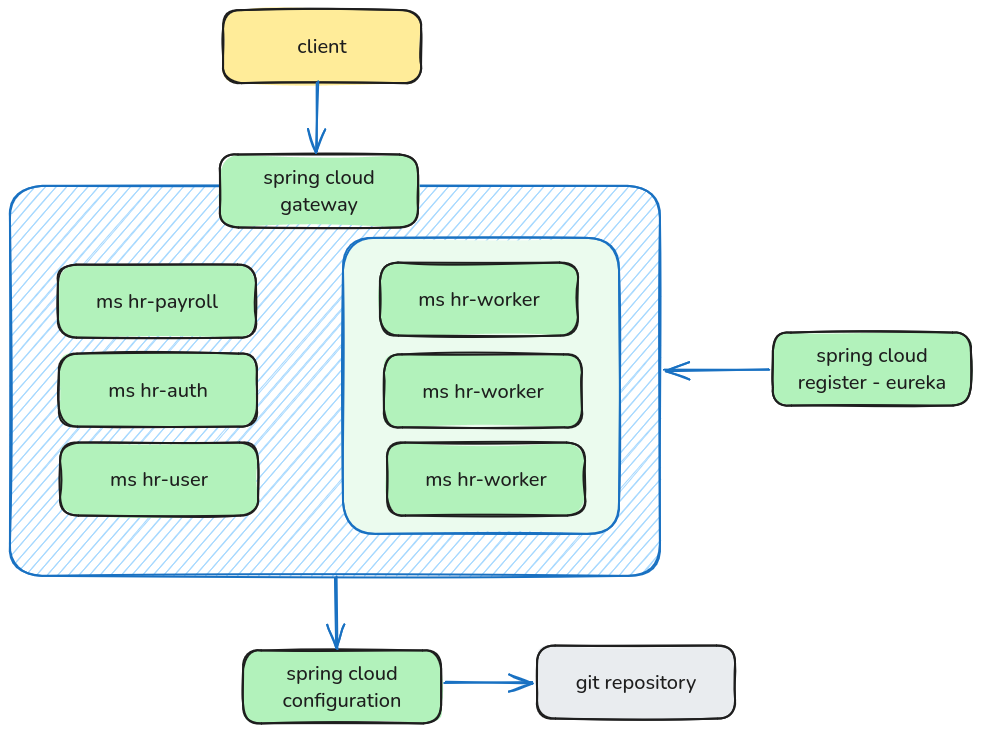

# 🧠 Spring Cloud Microservices - MS Course

Este projeto é um **ambiente de estudo completo** utilizando o ecossistema do **Spring Cloud** com foco em arquitetura de **microsserviços**, integração entre serviços, autenticação OAuth2 e balanceamento de carga. Ideal para quem deseja praticar os principais conceitos de arquitetura distribuída com ferramentas modernas e robustas.

---

## 📐 Arquitetura

A arquitetura está baseada em uma estrutura de microsserviços bem definida, utilizando as seguintes tecnologias e componentes:

- ✅ **Spring Boot 3.4.5**
- 🌩 **Spring Cloud 2024.0.1**
- 🧭 **Spring Cloud Gateway**
- 🧬 **Eureka Server** (Service Discovery)
- 🔐 **OAuth2 com JWT** (via Spring Security)
- 🤝 **Feign Client** (para comunicação entre serviços)
- ⚖️ **Spring Cloud LoadBalancer**
- 🧾 **JPA + H2/PostgreSQL** (persistência)
- ⚙️ **Spring Config Server** com repositório Git externo

---

## 🔧 Módulos do Projeto

```xml
<modules>
    <module>hr-config-server</module>
    <module>hr-eureka-server</module>
    <module>hr-gateway</module>
    <module>hr-payroll</module>
    <module>hr-worker</module>
    <module>hr-user</module>
    <module>hr-auth</module>
</modules>
```

### ✅ Descrição de cada módulo:

| Módulo             | Descrição                                                                 |
|--------------------|---------------------------------------------------------------------------|
| `hr-config-server` | Centraliza a configuração dos microsserviços via Git remoto               |
| `hr-eureka-server` | Service Discovery que registra todos os microsserviços                    |
| `hr-gateway`       | API Gateway central utilizando Spring Cloud Gateway                       |
| `hr-payroll`       | Serviço de folha de pagamento                                             |
| `hr-worker`        | Serviço de trabalhadores (podem existir várias instâncias)                |
| `hr-user`          | Serviço de usuários                                                       |
| `hr-auth`          | Serviço de autenticação com OAuth2 + JWT                                  |

---

## 🔗 Comunicação entre serviços

- Os microsserviços se registram no **Eureka Server**
- O Gateway redireciona as requisições para os microsserviços
- Os serviços utilizam **Feign** para se comunicarem internamente
- O **Config Server** centraliza as configurações, buscando de um **repositório Git**
- Autenticação com OAuth2 é gerenciada pelo serviço `hr-auth`, protegendo as rotas via tokens JWT

---

## 🖼️ Diagrama da Arquitetura

A imagem abaixo representa a estrutura e a comunicação entre os serviços:



---

## 🚀 Como rodar localmente

1. **Clone o projeto**:
```bash
git clone https://github.com/andregnicoletti/spring-boot-cloud-ms-course.git
```

2. **Configure o Git remoto no `hr-config-server`** com seu repositório de configurações.

3. **Rode os serviços na seguinte ordem:**

   1. `hr-config-server`
   2. `hr-eureka-server`
   3. `hr-gateway`
   4. Demais microsserviços (`auth`, `user`, `worker`, `payroll`)

4. Teste os endpoints via Postman ou Frontend.

---

## 🤝 Contribuição

Este projeto é um laboratório de aprendizado. Sinta-se à vontade para abrir PRs, sugerir melhorias ou utilizá-lo como base para projetos reais.

---

## 🧠 Créditos

Projeto baseado nos estudos do [Nelio Alves](https://www.udemy.com/course/microsservicos-java-spring-cloud/).

---

> Feito com 💚 por André Nicoletti